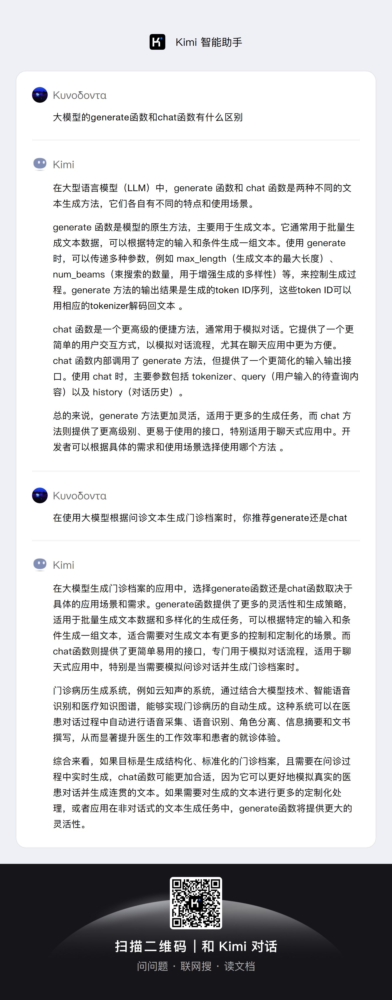

# 利用kimi大模型进行qwen模型的微调以及prompt工程

#### 介绍
在自己的知识有限的情况下，使用大模型来完成项目，是一个很好的选择。现在kimi允许上网，不仅使其在文科上拥有更加强大的表现，也因为可以联网到GSDN等论坛，有助于我们完成一些项目

#### 微调部分

 **User: 我的领导要求我对qwen模型进行微调，请给予我建议以及相关代码实现**

Kimi: Qwen模型是由阿里巴巴集团Qwen团队研发的大型语言模型和大型多模态模型系列，具备自然语言理解、文本生成等多种能力。针对您的需求，对Qwen模型进行微调，以下是一些建议和相关代码实现：

1. **环境安装**：确保Python环境已安装，并且具备英伟达显卡。需要安装的库包括`torch`, `transformers`, `datasets`等，以及`modelscope`库用于下载Qwen模型。

2. **数据准备**：微调需要准备特定格式的数据集，通常为JSONL格式，包含指令和期望输出。您可以使用`dataset_jsonl_transfer`函数转换原始数据集为所需格式。

3. **模型下载**：使用`modelscope`库的`snapshot_download`函数下载Qwen模型，例如`Qwen2-1.5B-Instruct`。

4. **微调配置**：配置训练参数，如批量大小、学习率、训练轮数等，并设置微调类型为LoRA。

5. **模型训练**：使用`Trainer`类进行模型训练，可以结合`SwanLabCallback`进行训练过程的监控和可视化。

6. **模型推理**：训练完成后，使用`PeftModel`加载微调后的模型，并进行预测。您可以使用`predict`函数进行模型推理。

以下是一个简化的代码示例，展示如何使用Qwen2模型进行指令微调：

（代码省略）

请注意，这只是一个非常基础的示例，实际微调过程需要根据您的具体需求进行调整。您可能需要调整模型配置、训练参数或数据处理方式以获得最佳效果。更多详细信息和完整代码，请参阅Qwen的官方文档和相关教程。 

 **User: 请帮我写出数据集代码** 

Kimi: 在进行Qwen模型的微调时，数据集的准备是一个关键步骤。以下是一个示例代码，展示如何准备和转换数据集，使其适用于Qwen模型的微调任务：

（代码省略）

这段代码首先定义了两个函数：`read_jsonl_file_to_list` 用于读取JSONL格式的文件并将每行解析为JSON对象，`convert_data_for_finetuning` 用于将原始数据转换为Qwen模型微调所需的格式。然后，代码读取原始数据集，转换数据，并将其保存为新的JSONL文件。最后，使用`datasets`库的`Dataset`类加载转换后的数据集，并打印出第一个样本以进行检查。

请注意，您需要根据自己的数据集格式和微调任务的具体需求来调整代码。上述代码中的`instruction`、`input`和`output`字段是示例，您可能需要根据实际情况进行修改。 

这里是kimi参考的文献：https://blog.csdn.net/SoulmateY/article/details/139564504

#### prompt工程部分

 **User: llm模型的generate函数和chat函数有什么区别**  

Kimi: 在大型语言模型（LLM）中，`generate`函数和`chat`函数是两种用于生成文本的方法，它们在使用场景和功能上存在一些区别。

`generate`函数是模型的原生方法，主要用于生成文本。它通常用于批量生成文本数据，可以根据特定的输入和条件生成一组文本。使用时需要传递一些参数，如`max_length`（生成文本的最大长度）、`num_beams`（束搜索的数量，用于增强生成的多样性）等。`generate`方法更加灵活，适用于更多的生成任务。

`chat`函数则是一个高级的便捷方法，通常用于模拟对话。它提供了更简单的用户交互方式，以模拟对话流程，尤其在聊天式应用中更为方便。`chat`方法内部调用了`generate`方法，但提供了更加简化的输入输出接口。它允许将对话历史作为上下文传递，从而生成与上下文相关的回复。

总的来说，选择使用`generate`方法或`chat`方法通常取决于你的具体需求和使用场景。如果你需要更灵活的文本生成能力，`generate`方法可能更适合；而如果你需要构建聊天应用，`chat`方法提供的简化接口可能更加方便。 

 **User: 前者有哪些参数**  

Kimi: `generate`函数是大型语言模型（LLM）中用于生成文本的核心方法，它接受多种参数来控制生成过程。以下是一些主要的参数：

1. **input_ids**：启动生成的输入token ID的张量 。
2. **max_length**：生成文本的最大长度 。
3. **min_length**：生成文本的最小长度 。
4. **do_sample**：是否在每一步进行概率采样来选择下一个token 。
5. **temperature**：调节随机性的温度参数，影响生成文本的多样性 。
6. **top_k**：每一步中考虑的最高概率token的数量，用于top-k采样 。
7. **top_p**：进行nucleus sampling时使用的累积概率阈值，用于控制生成时考虑的词汇范围 。
8. **num_beams**：波束搜索中使用的波束数，用于增强生成的多样性 。
9. **no_repeat_ngram_size**：禁止生成中重复出现的n-gram大小 。
10. **repetition_penalty**：用于减少在文本生成过程中出现重复片段的概率 。
11. **length_penalty**：控制生成结果长度的惩罚或奖励 。
12. **eos_token_id**：结束序列的token ID 。
13. **num_return_sequences**：一次生成多个候选输出的数量 。

这些参数共同决定了生成文本的方式和特性，可以根据不同的应用场景和需求进行调整。例如，增加`temperature`可以提高生成文本的多样性，而减小`top_k`或使用`top_p`采样可以避免生成最常见的token，从而增加文本的创造性 。 

 **User: 可以给一个python代码实例吗？** 

Kimi: 当然可以。以下是一个使用Python和Hugging Face的Transformers库中的`generate`方法的示例代码。这个例子假设你已经安装了Transformers库，并且有一个预训练的模型和对应的tokenizer。

（代码省略）

这段代码首先加载了GPT-2模型和它的tokenizer，然后定义了一些`generate`方法的参数，接着将输入文本编码为模型可以理解的格式，并调用`generate`方法生成文本，最后将生成的文本解码并打印出来。

请注意，你需要根据你的具体模型和tokenizer来调整`model_name`和其他参数。此外，这个例子使用了GPT-2模型，但`generate`方法可以与任何支持因果语言建模（Causal Language Modeling）的Transformers模型一起使用。 

 **User: 
帮我把文件里的chat函数换成generate函数，保证不报错** 

Kimi: 在Hugging Face的Transformers库中，`chat`函数是一个为对话场景设计的便捷函数，而`generate`函数是一个更通用的文本生成函数。由于`chat`函数内部可能会处理对话历史等逻辑，直接替换成`generate`可能需要一些调整来确保功能的正确性。

下面是将`chat`函数替换为`generate`函数的示例代码。请注意，由于原始的`chat`函数接受的参数和`generate`不同，我们需要对原始代码进行一些调整：

（代码省略）

请注意，我已经移除了`history`参数和相关逻辑，因为在`generate`方法中通常不需要处理对话历史。此外，我假设`examples.txt`文件中的内容是供模型学习用的示例文本，所以在输入文本中直接引用了它。

如果你希望保留`history`参数来维护对话状态，你可能需要自己实现这部分逻辑，因为标准的`generate`方法不提供这样的功能。此外，生成的文本是直接返回的，没有转换成JSON格式，因为`generate`方法不包含将文本解析为JSON的逻辑。如果需要生成JSON格式的文本，你可能需要在生成文本后手动实现这一转换。 

 **User: 这个open函数里的参数是什么** 

Kimi: 在Python中，`open`函数用于打开一个文件并返回一个文件对象，它可以接受多个参数来控制文件的打开模式和行为。以下是`open`函数的一些常用参数：

1. **file**: 要打开的文件的路径或文件对象。
2. **mode**: 打开文件的模式，常见的有：
   - `'r'`：读取模式（默认）。如果文件不存在，抛出`FileNotFoundError`。
   - `'w'`：写入模式。如果文件存在，会被覆盖。如果文件不存在，创建新文件。
   - `'x'`：独占创建模式。如果文件已存在，`open`会抛出`FileExistsError`。
   - `'a'`：追加模式。如果文件存在，写入操作会在文件末尾添加内容。如果文件不存在，创建新文件。
   - `'b'`：二进制模式。如果未指定，文件默认以文本模式打开。
3. **encoding**: 指定文件的编码，例如`'utf-8'`，用于正确读取或写入特定编码的文件。
4. **buffering**: 指定缓冲方式。默认是`-1`，表示使用系统默认的缓冲方式（通常是完全缓冲）。
5. **errors**: 指定如何转化或报告错误。常见的值有`'strict'`（默认），`'ignore'`，`'replace'`等。
6. **newline**: 控制如何处理文件中的新行字符。它可以是`'\n'`, `'\r'`, `'\r\n'`或`None`。
7. **closefd**: 如果`True`（默认），在文件对象被销毁时，底层的文件描述符也会被关闭。
8. ** opener**: 用于打开文件的自定义函数。

在你提供的代码示例中，`open`函数的调用如下：

```python
with open('study_data/examples.txt', 'r', encoding='utf-8') as file:
    examples = file.read()
```

这里的参数说明如下：
- `'study_data/examples.txt'`：文件路径，即要打开的文件。
- `'r'`：模式设置为读取模式。
- `encoding='utf-8'`：指定文件的编码为`'utf-8'`，这有助于正确读取包含多种语言字符的文本文件。

使用`with`语句可以确保文件在使用后正确关闭，即使在读取文件时发生异常也是如此。 

 **User: 
可以帮我把chat换成generate函数吗？保证尽量改变最小，不会报错** 

Kimi: 将`chat`函数替换为`generate`函数并确保最小化改变，你需要做以下几步：

1. 移除`chat`特有的参数，如`history`，因为`generate`不使用这些参数。
2. 将你的提示信息合并成一个单一的字符串，因为`generate`使用单个输入字符串。
3. 调用`generate`函数时，使用`input_ids`参数代替直接传递给`chat`的字符串。

下面是根据你的函数进行修改后的代码示例：
（代码省略）

请注意，我已经假设了一些函数（如`format_sentence_for_model`和`format_output`）的存在，你需要根据你的具体情况实现它们。此外，由于`generate`不处理历史信息，我移除了所有与`history`相关的代码。

由于`generate`方法不返回`response`和`history`，因此我也没有在`inference`函数中返回这些值。如果你需要处理多轮对话或状态，你可能需要自己实现状态管理逻辑。 

（代码省略）

请注意，这个示例代码没有包含从文本中提取特定病历信息的逻辑，因为`generate`函数生成的是自由形式的文本，而不是结构化的JSON输出。如果你需要生成结构化的JSON输出，你可能需要在生成文本之后进行额外的文本解析和处理。

此外，由于原始代码中的`history`参数在`generate`函数中没有使用，我已经将其移除。如果你需要维护对话状态或历史信息，你可能需要自己实现这一逻辑。

最后，`format_output`函数需要你根据你的具体需求来实现，将生成的文本转换为所需的JSON格式。由于这通常需要特定的逻辑来解析文本并提取关键信息，这里没有提供具体的实现。 

 **User: 
只需要将chat换成generate函数,不报错，可以怎么样改变。输出改变后的代码** 

Kimi: 要将`chat`函数替换为`generate`函数，我们需要对原始函数进行一些调整。由于`generate`函数不处理历史信息，我们将移除所有与`history`相关的参数。此外，我们将使用`input_ids`参数来传递经过编码的输入文本给`generate`函数。

以下是修改后的代码：

（代码省略）

请注意，我已经假设`format_output`函数是一个已经实现的函数，它将生成的文本转换为所需的JSON格式。你需要根据你的具体需求来实现这个函数。

此外，我添加了一个示例的`schema`字典和`IE_PATTERN`，以展示如何构建输入文本。在实际使用中，你应该根据你的具体需求来定义这些值。

最后，由于`generate`函数生成的是自由形式的文本，可能需要额外的逻辑来确保生成的文本符合JSON格式。这可能包括文本解析、关键词提取和格式化等步骤。这些步骤需要你根据你的具体应用场景来实现。 

kimi参考文献：https://blog.csdn.net/m0_51300331/article/details/139305726

#### 探讨的问题

问题1：使用generate还是chat函数
首先考虑CPU训练速度问题，generate不用计算历史，速度更快



训练结果已上传，可见generate结果较好

# 文心一言协助虚拟机的防火墙开关

叮！快来看看我和文心一言的奇妙对话～点击链接 https://yiyan.baidu.com/share/HHGsBWNdLt -- 文心一言，既能写文案、读文档，又能绘画聊天、写诗做表，你的全能伙伴！
